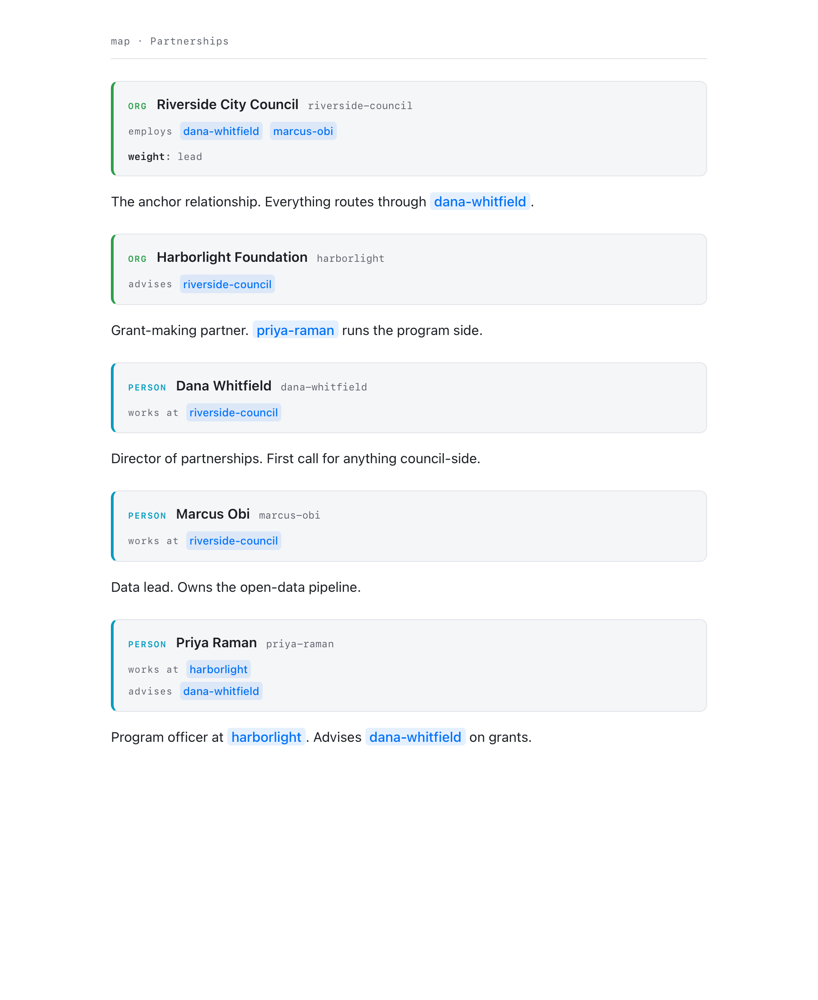
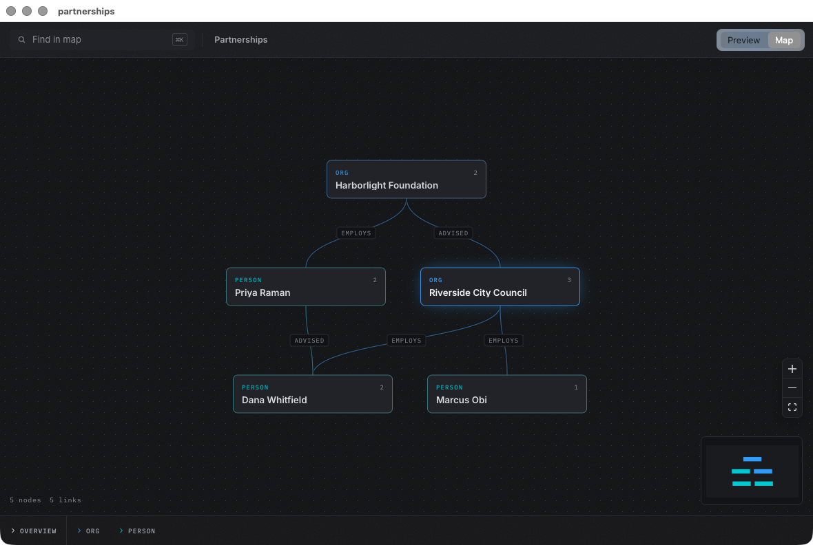

# mdsee

**Quick Look for markdown, two ways.** Press space on a `.md` file in Finder
and flip between a clean rendered preview and a visual map of the document's
structure — headings, bullets, and links drawn as a graph you can explore.

mdsee is a macOS fork of [md2hd](https://github.com/evan-steinhilb/md2hd) by
Evan Steinhilb — *"Markdown, mapped."* md2hd draws knowledge maps from
markdown frontmatter and wikilinks in your browser; mdsee wraps that same
canvas in a native Quick Look extension and viewer app, and teaches it to map
**any** markdown file, not just files authored for md2hd.

| Preview | Map |
| --- | --- |
|  |  |

## What you get

- **Quick Look extension** — spacebar any markdown file in Finder. A
  Preview / Map toggle sits in the top-right corner.
- **Preview face** — rendered markdown (light/dark aware). md2hd frontmatter
  node blocks render as styled cards — type badge, title, relationship chips —
  instead of raw YAML.
- **Map face** — the md2hd canvas, stripped of its app chrome. Just the
  graph, search, the type strip, and the node detail drawer.
- **MDSee.app** — the same viewer as a regular app. Open a markdown file, or
  point it at a whole folder of notes to map them together.

## Every file maps

md2hd draws nodes from frontmatter blocks and edges from `[[wikilinks]]` and
`rel:` entries. mdsee keeps that: files written as md2hd maps pass through
untouched and draw exactly as the CLI would draw them.

Plain markdown gets a map too. mdsee synthesizes one from the document's own
structure before handing it to the canvas:

- the **document** becomes the root node
- **headings** become nodes, typed by depth (`doc` → `section` → `topic` → `detail`)
- **top-level bullets and numbered steps** become `item` nodes under their
  section — a bold lead like `**02-career-profile.md** — the professional
  record…` becomes the node's title, the rest becomes its detail text
- nesting becomes `contains` edges, and any `[[wikilinks]]` in your notes
  become real edges between nodes

The Preview face always shows your file verbatim; only the map sees the
transformation.

## How it works

There is no server and nothing leaves your machine. The md2hd web app is
bundled prebuilt (`dist/`) and served to a `WKWebView` through a custom
`mdsee://` URL scheme handler; the file being previewed is injected directly
into the page as the same `__files.json` payload the md2hd CLI serves. The
whole thing is sandboxed with no network access.

## Building

Requires Xcode and [xcodegen](https://github.com/yonaskolb/XcodeGen)
(`brew install xcodegen`).

```sh
cd mac
xcodegen generate
xcodebuild -project MDSee.xcodeproj -scheme MDSee -configuration Release \
  -derivedDataPath build build
open build/Build/Products/Release/MDSee.app   # registers the extension
```

If another Quick Look extension already owns markdown previews (Markdown
Peek, QLMarkdown, …), pick the handler in **System Settings → General →
Login Items & Extensions → Quick Look**, or from a terminal:

```sh
pluginkit -e use -i com.goodgord.MDSee.QuickLook
```

`samples/partnerships.md` is a small hand-written md2hd map to try; any
markdown file exercises the outline map.

## Upstream

The md2hd CLI, web app, and markdown syntax are Evan Steinhilb's work —
docs at [md2hd.app](https://md2hd.app). The CLI still works from this fork
(`node bin/md2hd.mjs notes/`). The mac layer lives entirely in `mac/` so
upstream changes merge cleanly: `git merge upstream/main`, rebuild, done.

## License

MIT, same as upstream. See [LICENSE](LICENSE).
